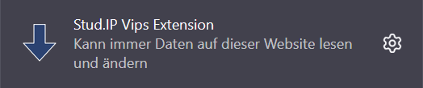
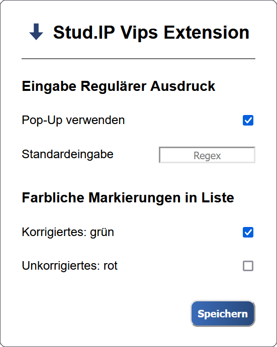

#  Stud.IP Vips Extension

Die **Stud.IP Vips Extension** erleichtert das Herunterladen von ausgewählten Abgaben und das Eintragen von Bewertungen in den [Vips](https://hilfe.studip.de/help/4.5/de/Vips/HomePage) von [Stud.IP](https://www.studip.de/) durch Filtern mithilfe von [regulären Ausdrücken](#beispiele-für-reguläre-ausdrücke).

## Features

* Schneller **Download** von Abgaben bestimmter Gruppen ( [$\downarrow$](#download) )

* **Springen** zu bestimmten Gruppen zum Eintragen der Bewertungen ( [$\downarrow$](#vor--und-zurückspringen) )

* Anschauliche **Übersicht** über ausgewählte Abgaben von der Detailansicht einer Aufgabe aus ( [$\downarrow$](#auswahlliste) )

## Installation

Aktuell ist die Extension nur offiziell für [Firefox](https://www.mozilla.org/de/firefox/new/) verfügbar.

Du kannst die `.xpi`-Datei der neusten Version der Extension unter [Releases](https://github.com/Tobostus/studip-vips-extension/releases) herunterladen und wie folgt in den Einstellungen installieren:

> Add-ons und Themes $\rightarrow$ Erweiterungen $\rightarrow$ Zahnrad $\rightarrow$ Add-on aus Datei installieren

**Alternativ** kannst du in einem [Firefox-Browser](https://www.mozilla.org/de/firefox/new/) einfach direkt auf die `.xpi`-Datei des neusten [Releases](https://github.com/Tobostus/studip-vips-extension/releases) klicken und die Installation erlauben.

## Aktualisierung

Ab Version `1.2.0` ist die automatische Aktualisierung verfügbar und kann in [Firefox](https://www.mozilla.org/de/firefox/new/)' Einstellungen aktiviert werden.

Für ältere Versionen, oder falls man die Updates manuell durchführen will, kann man einfach die [Schritte zur Installation](#installation) wiederholen - so wird die alte Version überschrieben.

## Verwendung

### Einstellungen

Unter den Erweiterungen in der Browserleiste kannst du die Einstellungen der Extension aufrufen:

Dann erscheint folgendes kleines Fenster, in dem du zwei Einstellungen treffen kannst:

* **Pop-Up verwenden**: Bestimmt, ob jedes Mal bei der Verwendung eines Buttons der Extension nach einem neuen [regulären Ausdruck](#beispiele-für-reguläre-ausdrücke) gefragt werden soll. Falls aktiviert, erscheint jeweils eine _Prompt_, die die _"Standardeingabe"_ enthält und von da aus veränderbar ist.

* **Standardeingabe**: Falls du _"Pop-Up verwenden"_ deaktivierst, werden immer direkt die Gruppen ausgewählt, die den [regulären Ausdruck](#beispiele-für-reguläre-ausdrücke) in der _"Standardeingabe"_ enthalten.

* **Korrigiertes: grün**: Falls aktiviert, werden in der [Auswahlliste](#auswahlliste) Gruppen, von denen alle Abgaben bereits korrigiert sind, **grün** markiert. Falls es auf einem Aufgabenblatt mehrere Aufgaben gibt, werden im Untermenü die einzelnen bereits korrigierten Aufgaben **grün** markiert. Falls deaktiviert, sind Listeneinträge, die sonst **grün** wären, **blau**.

* **Unkorrigiertes: rot**: Falls aktiviert, werden in der [Auswahlliste](#auswahlliste) Gruppen, von denen noch nicht alle Abgaben korrigiert wurden, **rot** markiert. Falls es auf einem Aufgabenblatt mehrere Aufgaben gibt, werden im Untermenü die einzelnen unkorrigierten Abgaben **rot** markiert. Falls deaktiviert, sind Listeneinträge, die sonst **rot** wären, **blau**.

* **Speichern**: Um deine Änderungen zu übernehmen, kannst du auf _"Speichern"_ drücken. Der Button wird kurz grün, wenn das Speichern erfolgreich war, und deine Einstellungen bleiben auch über Browser-Sitzungen hinweg gespeichert.

### Download

Die Extension fügt Seiten mit dem Pfad `/plugins.php/vipsplugin/solutions/assignment_solutions?...` einen Button zum Herunterladen hinzu:

Dieser lädt die Abgaben aller Gruppen, deren Namen den eingegebenen [regulären Ausdruck](#beispiele-für-reguläre-ausdrücke) enthalten, in einzelnen `.zip`-Dateien herunter. Ein leerer regulärer Ausdruck lädt entsprechend **alle** Abgaben in einzelnen `.zip`-Dateien herunter.

### Navigation

_**Achtung**: Die [Navigationsfeatures](#navigation) funktionieren nur in einem Browsertab, in dem zuvor die Abgabeübersicht geöffnet wurde. Die vorhandenen Gruppennamen und Links zu dazugehörenden Abgaben werden dort ausgelesen und zwischengespeichert._

In der Detailansicht einer Aufgabe, also auf Seiten mit dem Pfad `/plugins.php/vipsplugin/solutions/edit_solution?...`, fügt die Extension folgende drei Buttons hinzu:

#### Vor- und zurückspringen

 

Diese zwei Buttons springen zur vorherigen bzw. nächsten Gruppe, dessen Name den eingegebenen [regulären Ausdruck](#beispiele-für-reguläre-ausdrücke) beinhaltet.

#### Auswahlliste

Dieser Button öffnet eine Liste mit allen Gruppennamen, die den [regulären Ausdruck](#beispiele-für-reguläre-ausdrücke) enthalten, und lässt durch Klicken auf einen Gruppennamen zu der Detailansicht für die entsprechende Gruppe springen. Gruppen, die nichts abgegeben haben, sind ausgegraut.

Es können hier genau die Gruppennamen auftauchen, die in der Abgabeübersicht sichtbar waren (siehe [Warnung](#navigation)). D.h. es sollten keine ausgegrauten Gruppen sichtbar sein, falls ihr in der Übersicht _"Studierende mit abgegebenen Lösungen"_ ausgewählt habt.

Falls es auf einem Aufgabenblatt mehrere Aufgaben gibt, kann man nach der Auswahl der Gruppe die Aufgabe auswählen, die man öffnen will. Aufgaben, die nicht abgegeben wurden, sind ausgegraut.

Je nach [Einstellungen](#einstellungen) werden Aufgaben oder Gruppennamen ggf. **grün** oder **rot** markiert.

## Beispiele für reguläre Ausdrücke

Für eine detaillierte Erklärung von regulären Ausdrücken, siehe [Wikipedia](https://de.wikipedia.org/wiki/Regul%C3%A4rer_Ausdruck). Reguläre Ausdrücke werden auch mit **Regex** abgekürzt. Beispiele für eventuell nützliche reguläre Ausdrücke sind:

| Regex | Ausgewählte Gruppennamen | Beispiele |
| :-: | :- | :- |
| ` ` | Alle. (_leerer Regex_) | `Gruppe 1`, `Gruppe 2`, `Gruppe 3`, ... |
| `1` | Alle, die eine `1` enthalten. | `Gruppe 1`, `Gruppe 10`, `Gruppe 21`, ... |
| `Max` | Alle, die `Max` enthalten. | `Max Mustermann`, `Gruppe_bei_Maximilian`, ... |
| `2[0-9]` | Alle, die eine `2` gefolgt von einer weiteren Ziffer enthalten. | `Gruppe 20`, `Gruppe 21`, `Gruppe 200`, ... |
| `(10\|20)` | Alle, die eine `10` oder `20` enthalten. | `Gruppe 10`, `Gruppe 20`, `10:00Uhr_bei_Max`, ... |
| `^Max` | Alle, die mit `Max` beginnen. | `Max Mustermann`, `Maxine Mustermann`, ... |
| `3$` | Alle, die auf `3` enden. | `Gruppe 3`, `Gruppe 13`, `Gruppe 23`, ... |
| `^Gruppe 10$` | Der, der genau `Gruppe 10` entspricht. | `Gruppe 10`. |
| `10.*Max` | Alle, die `10` und `Max` in dieser Reihenfolge enthalten. | `10:00Uhr_bei_Max`, `Gruppe 10 bei Max`, ... |
| `(1[3-9]\|2[0-7])` | Alle, die eine Zahl zwischen `13` und `27` enthalten. | `Gruppe 13`, `Gruppe 14`, `Gruppe 126`, ... |
| `(2[1-9]\|3[0-9]\|4[0-2])` | Alle, die eine Zahl zwischen `21` und `42` enthalten. | `Gruppe 23`, `Gruppe 30`, `Gruppe 42`, ... |
| `([1-9]\|[1-9][0-9])` | Alle, die eine Zahl zwischen `1` und `99` enthalten. | `Gruppe 19`, `Gruppe 31`, `Gruppe 76`, ... |

## Lizenz

Dieses Projekt ist unter der GNU GPL-3.0 license lizensiert - siehe [LICENSE](LICENSE) für mehr Informationen. 